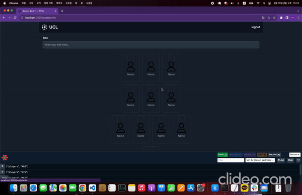
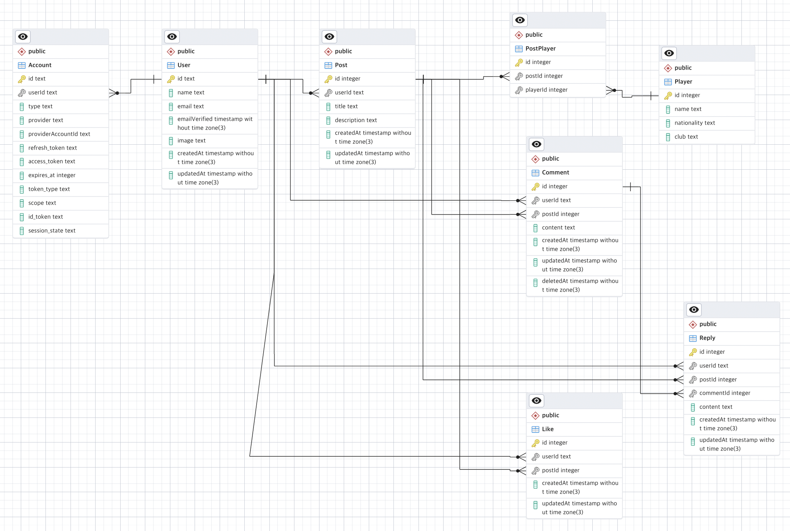

# Create your Best11!

#
[Features]
1. Google login
2. CRUD(Posts, comments, replies and likes)
#
[Technologies Used]
1. next.js 13
2. tailwindcss
3. react-query
4. prisma
5. postgresql
6. next-auth(google login)
7. firebase
#
[ERD]

#
[Setting .env]

1. DATABASE_URL: postgresql url  
2. GOOGLE_CLIENT_ID: google OAuth 2.0 client Id  
3. GOOGLE_CLIENT_SECRET: google OAuth 2.0 client secret  
4. SOCCER_BEST11_SERVER: your API URL (ex: http://localhost:3000)  
5. NEXTAUTH_SECRET="NEXTAUTH_SECRET"
6. import /data_preprocessiong/filtered_data.csv to your db table, 'Player'
#
[Detail]
1. Support dark & light mode  
2. Support Infinite Scroll + Pagination(posts)  
3. Support my page(View posts I wrote.)
4. Support best page(View posts received more than 2 recommendations. You can edit it.)  
4. Support Mobile ver(Responsive Web Design)  